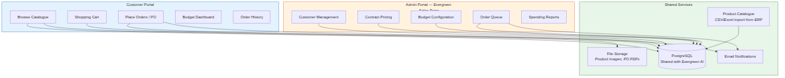
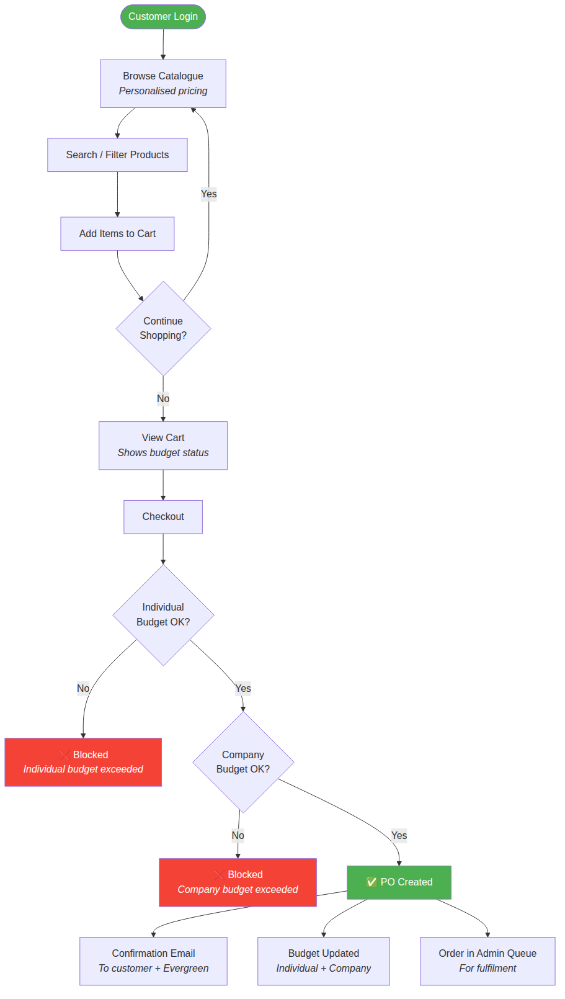
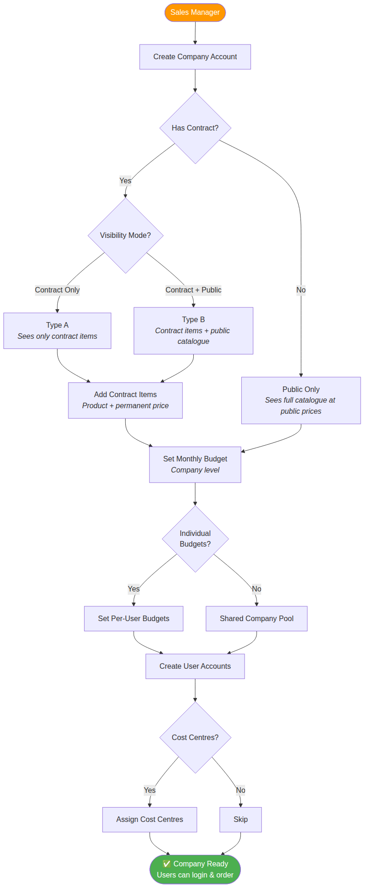
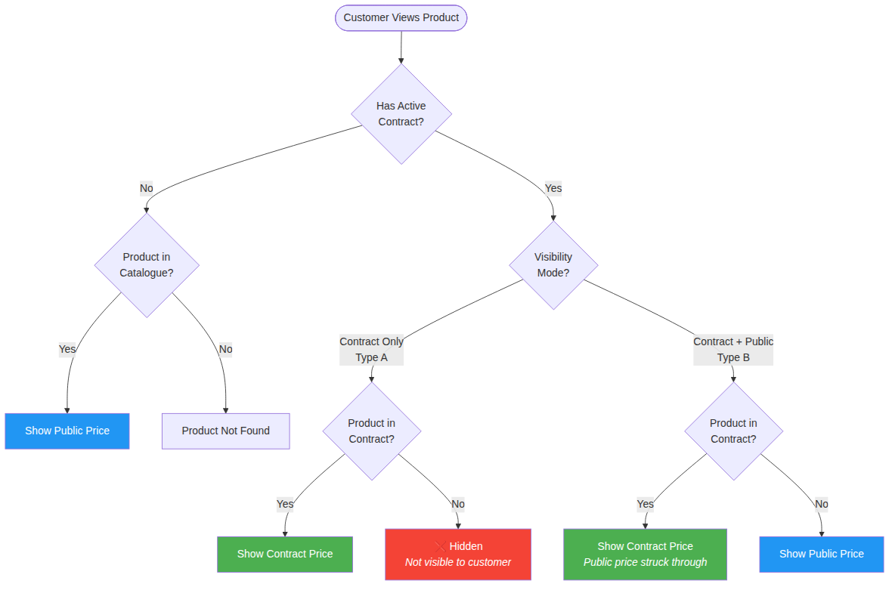
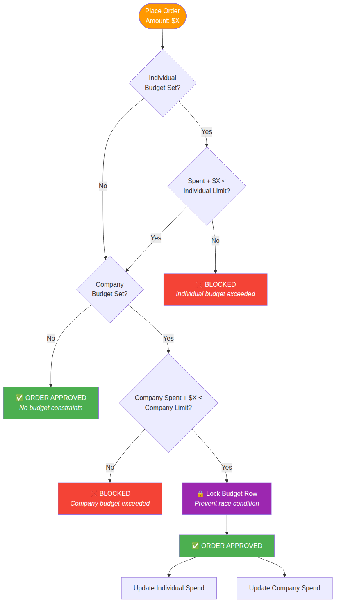
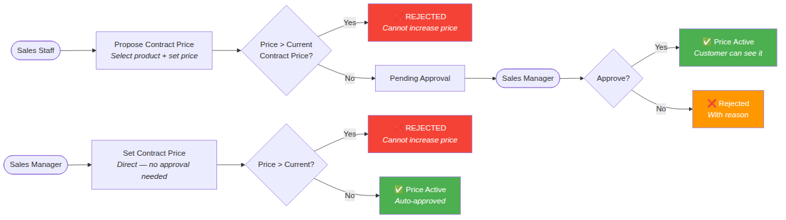

# Product Requirement Document (PRD)

| Field | Value |
|-------|-------|
| **Project** | Evergreen E-Com — B2B Procurement Portal |
| **Client** | Evergreen Group Pte Ltd |
| **Contact** | Mrs Wee |
| **Phone** | +65 9683 1343 / +65 9424 4633 |
| **Email** | mrswee@evergreen.com.sg |
| **Address** | 8 New Industrial Road, #01-02/03, LHK3, Singapore 536200 |
| **Version** | 1.1 |
| **Status** | Draft |
| **Author** | Aira Ling |
| **Reviewers** | Ken Ling |
| **Created** | 2026-02-26 |
| **Last Updated** | 2026-02-26 |

### Revision History

| Version | Date | Author | Changes |
|---------|------|--------|---------|
| 1.0 | 2026-02-26 | Aira Ling | Initial PRD |
| 1.1 | 2026-02-26 | Aira Ling | Added Customer Support & Quick Order epic (FR-018, FR-019) |

---

## 1. Executive Summary

Evergreen E-Com is a B2B procurement portal for Evergreen Group Pte Ltd's corporate customers. It is a separate add-on system to the main Evergreen AI document processing and marketing platform.

The portal enables corporate customers to browse Evergreen's office supplies catalogue, view personalised contract pricing, and place purchase orders directly. Each corporate customer sees a tailored experience: companies with negotiated contracts see their contract prices (and optionally the public catalogue), while non-contract customers see standard public pricing. The system enforces monthly budget limits at both company and individual user levels, with hard blocks when budgets are exceeded.

Evergreen's sales team manages all contract pricing, customer accounts, and budget allocations through an admin interface. Contract prices, once set, are permanent and can never be increased — only maintained or reduced. The portal targets approximately 1,000 corporate customers with up to 1,000 total users, generating purchase orders that Evergreen fulfils through their existing operations.

**Key differentiators:**
- Complex per-customer contract pricing (not simple discount tiers)
- Dual budget enforcement (company + individual)
- Cost centre tracking within companies
- Permanent pricing guarantee on contracts
- Direct PO generation (no payment gateway)

## 2. Problem Statement & Hypothesis

### Problem

Evergreen currently manages corporate customer pricing through manual quotations and offline communication. Sales staff maintain pricing in spreadsheets or their ERP, and customers must call, email, or WhatsApp to place orders. This creates bottlenecks:

- **For customers:** No self-service ordering, no visibility into their contract prices, no budget tracking
- **For Evergreen:** Sales team spends time on routine reorders, manual PO processing, and fielding price enquiries
- **For management:** No real-time visibility into customer spending patterns or budget utilisation

### Hypothesis

If we build a self-service B2B procurement portal with personalised contract pricing and budget controls, then corporate customers will be able to place orders independently, resulting in faster order processing, reduced sales overhead for routine orders, and better budget compliance for customers with spending limits.

## 3. User Personas

### Persona: Corporate Purchaser

| Attribute | Details |
|-----------|---------|
| **Who** | Office admin or procurement staff at a corporate customer. Comfortable with basic web apps and online shopping. Age 25–55. |
| **Goals** | Browse available products, see correct prices, place orders within budget, track order history |
| **Frustrations** | Having to call/email for prices, not knowing remaining budget, waiting for quotation responses |
| **Frequency** | Weekly to monthly ordering |
| **Devices** | Desktop (primary), mobile (occasional) |

### Persona: Company Manager (Customer Side)

| Attribute | Details |
|-----------|---------|
| **Who** | Office manager or finance controller at a corporate customer. Oversees procurement budget and spending. |
| **Goals** | Monitor team spending, track budget utilisation by cost centre, review order history |
| **Frustrations** | No visibility into who ordered what, manual budget tracking in Excel, surprise overspending |
| **Frequency** | Weekly review |
| **Devices** | Desktop |

### Persona: Evergreen Sales Manager

| Attribute | Details |
|-----------|---------|
| **Who** | Evergreen's sales team manager. Manages customer relationships, sets contract pricing, controls budgets. |
| **Goals** | Set and manage contract pricing, allocate customer budgets, monitor customer ordering activity, approve pricing changes |
| **Frustrations** | Manual pricing management, no centralised view of customer contracts, time spent on routine order enquiries |
| **Frequency** | Daily |
| **Devices** | Desktop |

### Persona: Evergreen Sales Staff

| Attribute | Details |
|-----------|---------|
| **Who** | Sales team member handling day-to-day customer management under the sales manager. |
| **Goals** | Create/update customer accounts, manage contract items, handle customer enquiries |
| **Frustrations** | Maintaining pricing in spreadsheets, manual order taking |
| **Frequency** | Daily |
| **Devices** | Desktop |

## 4. System Overview



## 5. User Journey Maps

### Journey: Customer Ordering Flow



### Journey: Customer Setup (Admin)



### Journey: Budget Period Reset

Monthly cycle ends → system resets company and individual budget utilisation to zero → budget limits unchanged → users can order again → previous month's spending retained in history.

---

## 6. Pricing Logic



## 7. Budget Enforcement Logic



## 8. Contract Pricing Approval Flow



---

## 9. Feature Requirements (Functional)

### Epic: Customer Management (Admin)

---

#### FR-001: Company Account Creation

| Field | Value |
|-------|-------|
| **Priority** | Must |
| **Epic** | Customer Management |
| **Description** | Evergreen sales manager creates corporate customer accounts. Each company has: name, billing address, delivery address(es), contact person, email, phone, contract status (has contract / no contract), visibility mode (contract-only / contract + public / public only), and status (active/inactive). |

**Acceptance Criteria:**

1. **Given** a sales manager is logged in, **When** they create a new company, **Then** a company record is created with all required fields and status "active".
2. **Given** a company is created, **When** contract status is set to "has contract", **Then** the manager must also set visibility mode: "contract-only" or "contract + public".
3. **Given** a company has no contract, **When** visibility mode is determined, **Then** it defaults to "public only" (sees full catalogue at public prices).
4. **Given** a company exists, **When** the manager deactivates it, **Then** all users under that company can no longer log in and see a "Account suspended" message.

---

#### FR-002: User Account Management

| Field | Value |
|-------|-------|
| **Priority** | Must |
| **Epic** | Customer Management |
| **Description** | Evergreen sales manager creates user accounts under each company. Each user has: name, email, phone, role (purchaser / company-viewer), assigned cost centre (optional), individual budget (optional), and status. Users log in with email + password. |

**Acceptance Criteria:**

1. **Given** a company exists, **When** a sales manager creates a user under that company, **Then** the user is linked to the company and inherits the company's pricing and visibility settings.
2. **Given** a user is created, **When** login credentials are set, **Then** the user receives a welcome email with login instructions and a temporary password.
3. **Given** a user account, **When** the manager assigns an individual budget, **Then** the user's purchases are capped at that budget per month in addition to the company budget.
4. **Given** a user account, **When** the manager assigns a cost centre, **Then** all orders by that user are tagged with that cost centre for reporting.
5. **Given** a single company can have up to 1,000 users, **When** the user list is viewed, **Then** it supports search, filter by company, and pagination without performance issues.

---

#### FR-003: Company Budget Configuration

| Field | Value |
|-------|-------|
| **Priority** | Must |
| **Epic** | Customer Management |
| **Description** | Evergreen sales manager sets monthly budgets per company. Two models supported: (1) Company-level budget only — all users share a single pool. (2) Company budget + individual user budgets — double constraint. Budget resets monthly on a configured date. Budget amount is in SGD. |

**Acceptance Criteria:**

1. **Given** a company account, **When** the manager sets a monthly budget of SGD 1,000, **Then** total orders from all users in that company cannot exceed SGD 1,000 per month.
2. **Given** a company with individual budgets, **When** User A has a SGD 300 limit and User B has a SGD 500 limit, **Then** User A cannot spend more than SGD 300 AND the combined spending cannot exceed the company budget.
3. **Given** budget is set, **When** the monthly reset date arrives, **Then** utilisation resets to zero automatically. Budget limits remain unchanged.
4. **Given** a company has no budget configured, **When** users order, **Then** there is no spending limit (unlimited).
5. **Given** budget settings, **When** the manager updates the budget amount, **Then** the new amount takes effect immediately for the current period. Remaining balance is recalculated.

---

#### FR-004: Cost Centre Management

| Field | Value |
|-------|-------|
| **Priority** | Should |
| **Epic** | Customer Management |
| **Description** | Evergreen sales manager can define cost centres for a company (e.g., "Marketing Dept", "Operations", "Front Office"). Users are assigned to a cost centre. Orders are tagged with the cost centre for reporting and budget tracking. Optionally, budgets can be set per cost centre. |

**Acceptance Criteria:**

1. **Given** a company account, **When** the manager creates cost centres, **Then** cost centre names are stored and available for user assignment.
2. **Given** cost centres exist, **When** a user places an order, **Then** the order is automatically tagged with the user's assigned cost centre.
3. **Given** cost centre reporting, **When** the manager views spending reports, **Then** they can filter and group spending by cost centre.
4. **Given** optional cost centre budgets, **When** a budget is set per cost centre, **Then** spending within that cost centre cannot exceed its allocated budget (in addition to company/individual limits).

---

### Epic: Contract Pricing

---

#### FR-005: Contract Price Management

| Field | Value |
|-------|-------|
| **Priority** | Must |
| **Epic** | Contract Pricing |
| **Description** | Evergreen sales manager creates and manages contract pricing per company. Each contract consists of a list of products with custom unit prices. Contract prices are permanent — once set, they can never be increased (can only stay the same or decrease). Contract items can be added or removed over time. Each contract item has: product, contract price, effective date, and optional expiry date. |

**Acceptance Criteria:**

1. **Given** a company with contract status, **When** the sales manager adds a product to the contract, **Then** a contract price is created with the product, unit price, and effective date.
2. **Given** an existing contract price of SGD 5.00 for a product, **When** the manager tries to update it to SGD 6.00, **Then** the system rejects the change with an error: "Contract prices cannot be increased."
3. **Given** an existing contract price of SGD 5.00, **When** the manager updates it to SGD 4.50, **Then** the new price takes effect and the old price is recorded in history.
4. **Given** a contract item with an expiry date, **When** the expiry date passes, **Then** the item remains visible in the contract history but is no longer active. The customer no longer sees that contract price (falls back to public price or item is hidden depending on visibility mode).
5. **Given** a contract item has expired, **When** viewed in admin, **Then** it shows as "expired" but is not deleted. Historical data is preserved.
6. **Given** a new contract price is created, **When** submitted, **Then** it requires sales manager approval before becoming active.

**Notes:** The permanent pricing guarantee is a core business rule — the system must enforce this at the database level, not just UI validation.

---

#### FR-006: Contract Pricing Approval

| Field | Value |
|-------|-------|
| **Priority** | Must |
| **Epic** | Contract Pricing |
| **Description** | New contract prices and price reductions require approval from the Evergreen sales manager before taking effect. Sales staff can propose contract prices, but only the manager can approve them. |

**Acceptance Criteria:**

1. **Given** a sales staff member proposes a contract price, **When** submitted, **Then** it enters "pending approval" status and the sales manager is notified.
2. **Given** a pending contract price, **When** the sales manager approves it, **Then** the price becomes active and visible to the customer.
3. **Given** a pending contract price, **When** the sales manager rejects it, **Then** the price is marked "rejected" with an optional reason, and the proposer is notified.
4. **Given** the sales manager creates a contract price directly, **When** submitted, **Then** it is auto-approved (no self-approval needed).

---

#### FR-007: Pricing Display Logic

| Field | Value |
|-------|-------|
| **Priority** | Must |
| **Epic** | Contract Pricing |
| **Description** | The catalogue displays different prices based on the logged-in user's company settings. Three visibility modes determine what the customer sees. |

**Pricing Rules:**

| Company Setting | Contract Items | Non-Contract Items |
|----------------|---------------|-------------------|
| Contract-only (Type A) | Shown at contract price | Hidden — not visible |
| Contract + Public (Type B) | Shown at contract price | Shown at public price |
| Public only (No contract) | N/A | Shown at public price |

**Acceptance Criteria:**

1. **Given** a Type A customer logs in, **When** they browse the catalogue, **Then** they see ONLY products that are in their active contract, at their contract prices.
2. **Given** a Type B customer logs in, **When** they browse the catalogue, **Then** they see contract items at contract prices AND all remaining catalogue items at public prices.
3. **Given** a customer with no contract logs in, **When** they browse the catalogue, **Then** they see all active products at public prices.
4. **Given** a contract item has expired, **When** a Type A customer browses, **Then** the expired item is no longer visible. For Type B, it falls back to public price.
5. **Given** a product appears in search results, **When** displayed, **Then** the price shown is always the correct price for that customer (contract or public). No price leakage between customers.

---

### Epic: Product Catalogue (Customer-Facing)

---

#### FR-008: Catalogue Browse & Search

| Field | Value |
|-------|-------|
| **Priority** | Must |
| **Epic** | Product Catalogue |
| **Description** | Customer-facing product catalogue with search, category filtering, and personalised pricing. Shared product data with the main Evergreen AI system (same database/catalogue). Supports full-text search by product name, SKU, brand, and category. |

**Acceptance Criteria:**

1. **Given** a logged-in customer, **When** they open the catalogue, **Then** products are displayed in a grid/list view with: product image, name, SKU, their price (contract or public), and "Add to Cart" button.
2. **Given** a customer searches for "A4 paper", **When** results are returned, **Then** only products visible to that customer are shown (respecting contract-only visibility).
3. **Given** a product has both contract and public price, **When** a Type B customer views it, **Then** the contract price is shown with the public price struck through (showing the savings).
4. **Given** category navigation, **When** a customer clicks a category, **Then** only products in that category (and visible to them) are shown.
5. **Given** the catalogue has 5,000+ products, **When** browsing and searching, **Then** results load within 2 seconds with pagination.

---

#### FR-009: Product Detail Page

| Field | Value |
|-------|-------|
| **Priority** | Must |
| **Epic** | Product Catalogue |
| **Description** | Detailed product page showing: product images, name, SKU, description, specifications, category, unit of measure, the customer's price, stock availability (if tracked), and quantity selector with "Add to Cart" button. |

**Acceptance Criteria:**

1. **Given** a customer clicks a product, **When** the detail page loads, **Then** all product information is displayed with the correct price for that customer.
2. **Given** a product with multiple images, **When** viewed, **Then** images are shown in a gallery with zoom capability.
3. **Given** a quantity selector, **When** the customer enters a quantity and clicks "Add to Cart", **Then** the item is added to their cart with the correct price × quantity.

---

### Epic: Shopping Cart & Ordering

---

#### FR-010: Shopping Cart

| Field | Value |
|-------|-------|
| **Priority** | Must |
| **Epic** | Shopping Cart & Ordering |
| **Description** | Persistent shopping cart showing selected items with quantities, unit prices, line totals, and cart total. Displays real-time budget information: remaining company budget and remaining individual budget (if applicable). Cart persists across sessions. |

**Acceptance Criteria:**

1. **Given** items are added to cart, **When** the cart is viewed, **Then** each item shows: product name, SKU, unit price, quantity (editable), line total, and a remove button.
2. **Given** a cart with items, **When** the cart total is calculated, **Then** it shows: subtotal, GST (if applicable), and grand total.
3. **Given** the user has a budget, **When** viewing the cart, **Then** a budget panel shows: company monthly budget, company spent this month, company remaining, and (if applicable) individual budget, individual spent, individual remaining.
4. **Given** the cart total would exceed either budget, **When** displayed, **Then** a warning is shown: "This order would exceed your budget. Remove items or reduce quantities."
5. **Given** a user logs out and back in, **When** they view the cart, **Then** previously added items are still there.

---

#### FR-011: Checkout & PO Creation

| Field | Value |
|-------|-------|
| **Priority** | Must |
| **Epic** | Shopping Cart & Ordering |
| **Description** | Checkout creates a Purchase Order (PO) directly — no payment gateway. The customer confirms delivery address, adds optional PO reference number and notes, and submits. The system validates budget constraints before creating the PO. Upon creation, the PO is sent to Evergreen for fulfilment. |

**Acceptance Criteria:**

1. **Given** a customer clicks "Checkout", **When** the checkout page loads, **Then** they see: order summary, delivery address (pre-filled, editable), optional PO reference number field, optional notes field, and "Place Order" button.
2. **Given** the customer clicks "Place Order", **When** budget validation runs, **Then** the system checks individual budget (if set) AND company budget. If EITHER would be exceeded, the order is rejected with a clear message.
3. **Given** budget validation passes, **When** the PO is created, **Then** a unique PO number is generated (e.g., PO-2026-00001), the order is saved with all line items, and the company/individual budget utilisation is updated.
4. **Given** a PO is created, **When** the order is confirmed, **Then** the customer sees a confirmation page with PO number, and a confirmation email is sent to both the customer and Evergreen's sales team.
5. **Given** a PO is created, **When** Evergreen's admin views the order, **Then** it appears in the order management queue for fulfilment.
6. **Given** two users from the same company order simultaneously and only SGD 100 remains in company budget, **When** both orders are for SGD 80, **Then** only the first order succeeds; the second is rejected (race condition handling via database-level locking).

**Notes:** No payment processing. This is a PO-based system — Evergreen invoices the customer separately through their existing billing process.

---

#### FR-012: Order History

| Field | Value |
|-------|-------|
| **Priority** | Must |
| **Epic** | Shopping Cart & Ordering |
| **Description** | Customers can view their order history. Each order shows: PO number, date, items, total, status (submitted/processing/fulfilled/cancelled), and delivery details. Company managers can view all orders across their company. |

**Acceptance Criteria:**

1. **Given** a purchaser views order history, **When** the page loads, **Then** they see their own orders, most recent first, with key columns: PO number, date, total, status.
2. **Given** a company manager views order history, **When** they select "All Company Orders", **Then** they see orders from all users in their company, filterable by user, date, and cost centre.
3. **Given** an order, **When** the customer clicks it, **Then** they see full order details: line items, quantities, prices, totals, delivery address, and status history.

---

#### FR-013: Reorder

| Field | Value |
|-------|-------|
| **Priority** | Should |
| **Epic** | Shopping Cart & Ordering |
| **Description** | Customers can reorder from a previous order with one click. All items from the previous order are added to the cart at current prices (contract or public). If a product is no longer available or contract has expired, the customer is notified. |

**Acceptance Criteria:**

1. **Given** a previous order, **When** the customer clicks "Reorder", **Then** all items are added to the cart at current prices.
2. **Given** an item in the reorder is no longer available or contract-expired, **When** added to cart, **Then** the customer is notified: "X items could not be added" with reasons.
3. **Given** prices have changed (decreased) since the original order, **When** the cart is populated, **Then** the new (lower) prices are used.

---

### Epic: Budget & Spending

---

#### FR-014: Budget Dashboard (Customer)

| Field | Value |
|-------|-------|
| **Priority** | Must |
| **Epic** | Budget & Spending |
| **Description** | Customer-side dashboard showing budget utilisation. Purchasers see their individual budget status. Company managers see company-wide budget with breakdown by user and cost centre. Visual indicators (progress bars, colour coding) for budget health. |

**Acceptance Criteria:**

1. **Given** a purchaser logs in, **When** the dashboard loads, **Then** they see: their individual budget (if set), amount spent this month, remaining balance, and a progress bar.
2. **Given** a company manager logs in, **When** the dashboard loads, **Then** they see: company budget, total spent, remaining, and breakdown by cost centre and by user.
3. **Given** budget utilisation exceeds 80%, **When** displayed, **Then** the progress bar turns amber. At 95%+, it turns red.
4. **Given** budget is exhausted (100%), **When** the user tries to add items to cart, **Then** they see: "Your monthly budget has been reached. Orders will be available next month."

---

#### FR-015: Spending Reports (Admin)

| Field | Value |
|-------|-------|
| **Priority** | Should |
| **Epic** | Budget & Spending |
| **Description** | Evergreen admin can view spending reports across all customers. Filter by company, date range, cost centre. Export to Excel. Shows: total orders, total spend, budget utilisation %, top products ordered. |

**Acceptance Criteria:**

1. **Given** an admin opens spending reports, **When** filtering by company and date range, **Then** results show all orders matching the criteria with totals.
2. **Given** report results, **When** the admin clicks "Export", **Then** an Excel file is downloaded with all report data.
3. **Given** an admin views the overview, **When** the page loads, **Then** they see: total active companies, total orders this month, total revenue this month, and companies approaching budget limits.

---

### Epic: Order Management (Admin)

---

#### FR-016: Order Queue

| Field | Value |
|-------|-------|
| **Priority** | Must |
| **Epic** | Order Management |
| **Description** | Evergreen admin view of all incoming purchase orders. Table with: PO number, customer company, order date, total amount, status, items count. Filterable by status, company, date. Admin can update order status as it progresses through fulfilment. |

**Acceptance Criteria:**

1. **Given** an admin opens the order queue, **When** the page loads, **Then** all POs are shown, most recent first, with filter and search.
2. **Given** a new PO arrives, **When** viewed by admin, **Then** it shows status "submitted" and all order details.
3. **Given** an admin updates order status to "processing" or "fulfilled", **When** saved, **Then** the customer can see the updated status in their order history.
4. **Given** an admin needs to cancel an order, **When** they cancel it, **Then** the budget utilisation is reversed (refunded to the company/individual budget).

---

#### FR-017: Order Notifications

| Field | Value |
|-------|-------|
| **Priority** | Should |
| **Epic** | Order Management |
| **Description** | Email notifications for key order events. Customer receives: order confirmation, status updates. Evergreen receives: new order alert. |

**Acceptance Criteria:**

1. **Given** a PO is created, **When** confirmed, **Then** an email is sent to the customer with order details and PO number.
2. **Given** order status changes, **When** updated by admin, **Then** the customer receives an email notification with the new status.
3. **Given** a new PO is submitted, **When** created, **Then** Evergreen's sales team receives an email alert.

---

### Epic: Customer Support & Quick Order

---

#### FR-018: Paste Order (AI-Powered Quick Order)

| Field | Value |
|-------|-------|
| **Priority** | Must |
| **Epic** | Customer Support & Quick Order |
| **Description** | Customers can paste a free-text order list (e.g. copied from an email, internal requisition, or typed manually) and the AI parses it into structured line items matched against the catalogue. This allows bulk ordering without browsing item by item — especially useful for repeat buyers who know what they need. |

**Acceptance Criteria:**

1. **Given** a customer opens the Quick Order page, **When** they paste text like "A4 paper 80gsm x 50 reams, Pilot pen blue x 100", **Then** the AI parses each line into: product name, quantity, and matched catalogue product.
2. **Given** the AI matches products, **When** results are displayed, **Then** each line shows: parsed item, matched product (with confidence), unit price (contract or public), quantity, and line total. Low-confidence matches are highlighted for manual selection.
3. **Given** a parsed item cannot be matched (confidence < 0.5), **When** displayed, **Then** the customer can manually search and select from the catalogue, or remove the item.
4. **Given** all items are confirmed, **When** the customer clicks "Add All to Cart", **Then** all matched items are added to the shopping cart at the correct prices.
5. **Given** various input formats (comma-separated, line-by-line, with or without quantities, SKU codes mixed with product names), **When** pasted, **Then** the AI handles all reasonable formats and extracts product + quantity pairs.
6. **Given** a customer pastes a large order (100+ items), **When** processing, **Then** results are returned within 10 seconds with a progress indicator.

**Notes:** Uses the same AI/LLM stack as the document extraction module. Leverage the product catalogue + supplier product mapping for fuzzy matching. This is a key productivity feature for large corporate customers who order in bulk.

---

#### FR-019: Customer Support Chat

| Field | Value |
|-------|-------|
| **Priority** | Should |
| **Epic** | Customer Support & Quick Order |
| **Description** | In-portal customer support channel. Customers can submit enquiries, report issues, or ask about products/orders. Evergreen's sales team receives and responds through the admin portal. Conversation history is preserved per customer. |

**Acceptance Criteria:**

1. **Given** a logged-in customer, **When** they click "Support" or the chat icon, **Then** a chat/messaging interface opens where they can type a message and attach files (e.g. photos of products, PO documents).
2. **Given** a customer sends a support message, **When** submitted, **Then** it appears in the admin portal's support queue with customer name, company, and message.
3. **Given** an admin replies to a support message, **When** sent, **Then** the customer sees the reply in their support chat and receives an email notification.
4. **Given** a customer has previous support conversations, **When** they open support, **Then** they can see their full conversation history.
5. **Given** the support queue, **When** an admin views it, **Then** messages are listed by most recent, filterable by company, status (open/resolved), and assignee.

**Notes:** Phase 1 is a simple messaging system (not real-time chat). Phase 2 could add AI-assisted responses for common enquiries (product availability, order status, pricing questions).

---

### Epic: Authentication & Access

---

#### FR-020: Customer Login

| Field | Value |
|-------|-------|
| **Priority** | Must |
| **Epic** | Authentication & Access |
| **Description** | Email + password login for corporate customers. Password reset via email. Account is linked to a company with inherited pricing and budget settings. |

**Acceptance Criteria:**

1. **Given** a registered user, **When** they enter correct credentials, **Then** they are logged in and see their company's personalised catalogue.
2. **Given** a user's company is deactivated, **When** they try to log in, **Then** they see: "Your account has been suspended. Contact Evergreen."
3. **Given** a user forgets their password, **When** they click "Forgot Password", **Then** a reset link is sent to their email.

---

#### FR-021: Admin Authentication

| Field | Value |
|-------|-------|
| **Priority** | Must |
| **Epic** | Authentication & Access |
| **Description** | Separate admin login for Evergreen staff. Roles: Sales Manager (full admin access, pricing approval), Sales Staff (customer management, no pricing approval). Admin portal is separate from the customer-facing portal. |

**Acceptance Criteria:**

1. **Given** a sales manager logs in, **When** authenticated, **Then** they have access to all admin features including pricing approval.
2. **Given** a sales staff member logs in, **When** authenticated, **Then** they can manage customers and propose contract prices, but cannot approve pricing changes.

---

## 10. Non-Functional Requirements

### Performance

| Metric | Target |
|--------|--------|
| Page load time | < 2s |
| Search response | < 1s |
| Catalogue browse (personalised) | < 2s |
| Checkout/PO creation | < 3s |
| API response time | < 500ms p95 |
| Concurrent users | 500 (with 10,000–50,000+ registered) |
| Uptime | 99.5% |

### Security

- [x] HTTPS everywhere
- [x] Email + password authentication with bcrypt hashing
- [x] Role-based access control (Sales Manager, Sales Staff, Customer Purchaser, Customer Manager)
- [x] Company-level data isolation — customers cannot see other companies' data, prices, or orders
- [x] Contract price enforcement at database level (cannot increase constraint)
- [x] Budget enforcement with database-level locking (prevent race conditions)
- [x] Session management with JWT
- [x] Input validation and sanitisation
- [x] PDPA compliance for customer data

### Scalability

- ~1,000 corporate customers, up to 1,000 users per company (potential 10,000–50,000+ total users)
- Product catalogue: 5,000–10,000 SKUs
- Orders: estimated 5,000–20,000/month
- Architecture supports 5x growth without re-architecture

## 11. Information Architecture / Sitemap

```
Evergreen E-Com
├── Customer Portal
│   ├── Login
│   ├── Dashboard
│   │   ├── Budget Overview
│   │   └── Recent Orders
│   ├── Catalogue
│   │   ├── Browse by Category
│   │   ├── Search
│   │   └── Product Detail
│   ├── Cart
│   │   ├── Cart Items
│   │   ├── Budget Status
│   │   └── Checkout
│   ├── Orders
│   │   ├── Order History
│   │   └── Order Detail
│   ├── Quick Order (Paste Order)
│   ├── Support Chat
│   └── Account
│       ├── Profile
│       └── Change Password
│
├── Admin Portal
│   ├── Login
│   ├── Dashboard
│   │   ├── Orders Overview
│   │   ├── Revenue Summary
│   │   └── Budget Alerts
│   ├── Customers
│   │   ├── Company List
│   │   ├── Company Detail / Edit
│   │   ├── User Management
│   │   ├── Cost Centre Management
│   │   └── Budget Configuration
│   ├── Contracts
│   │   ├── Contract Pricing per Company
│   │   ├── Pricing Approval Queue
│   │   └── Contract History
│   ├── Orders
│   │   ├── Order Queue
│   │   ├── Order Detail
│   │   └── Order Status Management
│   ├── Reports
│   │   ├── Spending by Company
│   │   ├── Spending by Cost Centre
│   │   ├── Budget Utilisation
│   │   └── Top Products
│   ├── Support Queue
│   │   ├── Open Tickets
│   │   └── Conversation View
│   └── Settings
│       ├── Admin Users
│       ├── Public Price Management
│       └── System Config
```

## 12. Screen-by-Screen Specs

### Screen: Customer Dashboard

| Field | Details |
|-------|---------|
| **URL** | /dashboard |
| **Purpose** | Landing page after login — budget status and quick actions |
| **Access** | All customer users |

**Key Elements:**
- Welcome message with company name
- Budget widget: progress bar showing monthly spend vs budget, remaining amount
- Individual budget widget (if applicable)
- Recent orders list (last 5)
- Quick actions: "Browse Catalogue", "Reorder Last Order"
- Cost centre breakdown (if company manager)

**Edge Cases:**
- No budget set: budget widget shows "No spending limit"
- No orders yet: "No orders yet. Start browsing the catalogue!"
- Budget exceeded: red banner "Monthly budget reached. Orders available next month."

---

### Screen: Catalogue / Product Listing

| Field | Details |
|-------|---------|
| **URL** | /catalogue |
| **Purpose** | Browse and search products with personalised pricing |
| **Access** | All customer users |

**Key Elements:**
- Search bar (full-text: name, SKU, brand)
- Category sidebar/filter
- Product grid: image, name, SKU, price, "Add to Cart" button with quantity input
- For Type B customers: contract items show contract price with public price struck through
- Pagination (24 products per page)
- Sort: name, price low-high, price high-low, category

**Edge Cases:**
- Type A customer sees empty category: category is hidden from navigation
- Product with no image: placeholder image
- Search returns no results: "No products found. Try a different search term."

---

### Screen: Shopping Cart

| Field | Details |
|-------|---------|
| **URL** | /cart |
| **Purpose** | Review items, see budget impact, proceed to checkout |
| **Access** | All customer users |

**Key Elements:**
- Item table: image, name, SKU, unit price, quantity (editable), line total, remove button
- Order summary: subtotal, GST, grand total
- Budget panel: company budget bar + individual budget bar
- Warning if order would exceed budget (items highlighted)
- "Checkout" button (disabled if budget exceeded)
- "Continue Shopping" link

**Edge Cases:**
- Empty cart: "Your cart is empty."
- Budget exceeded: checkout button greyed out with explanation
- Item no longer available: flagged with warning, option to remove
- Concurrent budget change: re-validate on checkout click

---

### Screen: Checkout

| Field | Details |
|-------|---------|
| **URL** | /checkout |
| **Purpose** | Confirm order details and create PO |
| **Access** | All customer users |

**Key Elements:**
- Order summary (read-only)
- Delivery address (pre-filled from company, editable)
- PO reference number (optional text field — customer's internal reference)
- Notes (optional textarea)
- "Place Order" button
- Terms acknowledgment checkbox

**Edge Cases:**
- Budget race condition: final budget check on submit, show error if exceeded
- Server error: "Order could not be placed. Please try again."

---

### Screen: Admin — Contract Pricing

| Field | Details |
|-------|---------|
| **URL** | /admin/customers/:id/contract |
| **Purpose** | Manage contract items and pricing for a specific company |
| **Access** | Sales Manager, Sales Staff |

**Key Elements:**
- Company header with contract status and visibility mode
- Contract items table: product name, SKU, contract price, effective date, expiry date, status (active/expired/pending approval)
- "Add Product" button → opens product search to add to contract with price
- Edit price (only decrease allowed — increase blocked with error)
- Price history log per item
- Approval status indicators (pending/approved/rejected) — manager can approve inline

**Edge Cases:**
- Price increase attempt: inline error "Contract prices cannot be increased"
- Expired item: greyed out row with "Expired" badge
- Large contract (500+ items): paginated, searchable

---

## 13. API / Integration Requirements

| Integration | Type | Purpose | Direction | Auth | Owner |
|-------------|------|---------|-----------|------|-------|
| Evergreen AI Product Catalogue | Shared DB / Internal API | Product data, images, categories | Read | Internal | NexStack |
| Email (SMTP / Resend) | SMTP / REST | Order confirmations, notifications, password reset | Outbound | API key | NexStack |
| DigitalOcean Spaces | S3-compatible | Product images, PO PDFs | Read | Access key | NexStack |

### Key Integration Notes

- **Shared Catalogue:** Product data comes from the same database as the main Evergreen AI system. The E-Com portal reads from it; only the AI system writes to it (via CSV import).
- **No Payment Gateway:** PO-based ordering only. No Stripe/PayNow integration.
- **No ERP Integration:** POs are managed within this system. Evergreen staff handle fulfilment through their existing processes.

## 14. Data Model Overview

```
Company (1) ──── (N) User
Company (1) ──── (N) ContractItem
Company (1) ──── (N) CostCentre
Company (1) ──── (1) CompanyBudget
User (1) ──── (0..1) UserBudget
User (1) ──── (N) Order
Order (1) ──── (N) OrderLineItem
OrderLineItem (N) ──── (1) Product  [shared with Evergreen AI]
ContractItem (N) ──── (1) Product
ContractItem (1) ──── (N) ContractPriceHistory
User (N) ──── (0..1) CostCentre
```

**Key Entities:**

| Entity | Key Fields | Notes |
|--------|-----------|-------|
| **Company** | id, name, billing_address, delivery_addresses (JSON), contact_person, email, phone, contract_status (has_contract/no_contract), visibility_mode (contract_only/contract_public/public_only), status (active/inactive), created_at | Core tenant entity |
| **User** | id, company_id, name, email, password_hash, role (purchaser/company_manager), cost_centre_id, status, created_at | Customer portal users |
| **CompanyBudget** | id, company_id, monthly_limit, budget_reset_day, current_month_spend, period_start, period_end | Company-level budget |
| **UserBudget** | id, user_id, monthly_limit, current_month_spend, period_start, period_end | Individual user budget |
| **CostCentre** | id, company_id, name, budget_limit (optional), current_month_spend | Departmental grouping |
| **ContractItem** | id, company_id, product_id, contract_price, effective_date, expiry_date, status (pending/active/expired/rejected), proposed_by, approved_by, approved_at | Per-company product pricing |
| **ContractPriceHistory** | id, contract_item_id, old_price, new_price, changed_by, changed_at, reason | Audit trail for price changes |
| **Order** | id, user_id, company_id, cost_centre_id, po_number, customer_po_ref, delivery_address, notes, subtotal, gst, total, status (submitted/processing/fulfilled/cancelled), created_at | Purchase orders |
| **OrderLineItem** | id, order_id, product_id, product_name, sku, unit_price, quantity, line_total | Order line items (prices snapshot at order time) |
| **AdminUser** | id, name, email, password_hash, role (sales_manager/sales_staff), status | Evergreen internal staff |
| **Product** | (shared with Evergreen AI) id, sku, name, category_id, brand, description, unit_price (public price), image_url, status | Shared catalogue — read only from E-Com |

## 15. Error Handling & Edge Cases

| Scenario | User Message | System Action | Severity |
|----------|-------------|---------------|----------|
| Budget exceeded at checkout | "Your order exceeds your monthly budget. Remaining: SGD X." | Block order, show remaining budget | High |
| Company budget exceeded (concurrent orders) | "Your company budget has been reached for this month." | Database-level lock prevents race condition | Critical |
| Contract price increase attempt | "Contract prices cannot be increased." | Reject at API + DB constraint level | High |
| Expired contract item ordered | "This product is no longer available at contract pricing." | Remove from cart or update to public price | Medium |
| Company deactivated mid-session | "Your account has been suspended." | Force logout, block new orders | High |
| Product removed from catalogue | "This product is no longer available." | Flag in cart, allow removal | Medium |
| Budget reset during active session | (Silent) | Recalculate on next action | Low |
| Large order with many items (100+) | Allow | Pagination in order detail | Low |

## 16. Dependencies & Risks

| Risk | Likelihood | Impact | Mitigation | Owner |
|------|-----------|--------|------------|-------|
| Complex pricing logic bugs (wrong price shown) | Medium | Critical | Database-level constraints, extensive testing per customer type, price audit logging | NexStack BE |
| Budget race conditions (overspend) | Medium | High | Database-level row locking on budget check + deduct, atomic transactions | NexStack BE |
| Contract price "never increase" constraint bypassed | Low | Critical | DB CHECK constraint + application validation + audit trail | NexStack BE |
| Catalogue sync delay (stale product data) | Low | Medium | Shared database eliminates sync; real-time reads from catalogue | NexStack |
| Customer onboarding effort (1,000 companies) | High | Medium | Bulk import tool for companies + contracts from Excel/CSV | NexStack + Client |
| User management overhead | Medium | Medium | Self-service password reset, bulk user creation | NexStack |
| Performance with personalised pricing queries | Medium | Medium | Indexed queries, caching contract prices per session, materialised views if needed | NexStack BE |

## 17. Release Criteria / Definition of Done

- [ ] All Must-have features (FR-001 through FR-021) implemented and tested
- [ ] Paste Order tested with various input formats (free text, CSV-style, mixed SKUs and names)
- [ ] Customer support messaging flow tested end-to-end
- [ ] Pricing logic tested for all 3 visibility modes with multiple customer types
- [ ] Contract price "cannot increase" constraint verified at DB + API + UI level
- [ ] Budget enforcement tested: individual limit, company limit, concurrent orders
- [ ] Race condition testing: simultaneous orders depleting same budget
- [ ] PO creation end-to-end: browse → cart → checkout → PO generated → admin notified
- [ ] 3 test companies created with different pricing configurations (Type A, Type B, no contract)
- [ ] Admin workflow tested: create company, add users, set contract prices, approve, set budgets
- [ ] Performance tested with 10,000+ users, 1,000 companies, and 5,000+ products
- [ ] Email notifications working (order confirmation, status updates)
- [ ] Customer password reset flow tested
- [ ] Mobile-responsive customer portal
- [ ] UAT sign-off from client
- [ ] Deployed to production

## 18. Tech Stack Recommendations

| Layer | Technology | Rationale |
|-------|-----------|-----------|
| **Frontend** | Next.js 14 (App Router) + Tailwind CSS + shadcn/ui | Consistent with Evergreen AI main system |
| **Backend** | Next.js API Routes or Hono.js | Shared codebase with main system possible |
| **Database** | PostgreSQL (shared with Evergreen AI) | Shared catalogue, strong constraint support for pricing rules |
| **Auth** | NextAuth.js or custom JWT | Separate auth for customer portal + admin portal |
| **Email** | Resend | Transactional emails (order confirmations, password reset) |
| **File Storage** | DigitalOcean Spaces | Shared with main system for product images |
| **Hosting** | DigitalOcean App Platform | Same infrastructure as main system |

**Database Constraints (Critical):**
```sql
-- Contract price can never increase
ALTER TABLE contract_item ADD CONSTRAINT price_never_increases
  CHECK (contract_price <= (SELECT contract_price FROM contract_price_history ...));

-- Budget enforcement at DB level
-- Use SELECT ... FOR UPDATE on budget rows during checkout
```

## 19. Timeline & Milestones

*Add-on system, scoped and priced separately from the main Evergreen AI (SGD 50K) project. Development follows a monthly iterative approach.*

### Phase 1: Core Procurement Portal
- Company & user management (admin)
- Contract pricing with approval workflow
- Personalised catalogue (3 visibility modes)
- Shopping cart with budget display
- Checkout → PO creation
- Budget enforcement (company + individual)
- Order history (customer + admin)

### Phase 2: Enhancements
- Cost centre management & reporting
- Spending reports & analytics
- Reorder functionality
- Bulk company/user import
- Advanced search & filters

## 20. Appendix

### Pricing Visibility Matrix

| | Type A (Contract Only) | Type B (Contract + Public) | No Contract |
|---|---|---|---|
| Contract product | ✅ Contract price | ✅ Contract price (public struck through) | N/A |
| Non-contract product | ❌ Hidden | ✅ Public price | ✅ Public price |
| Expired contract product | ❌ Hidden | ✅ Falls back to public price | N/A |

### Budget Enforcement Matrix

| Check | Individual Budget Set? | Company Budget Set? | Result |
|-------|----------------------|--------------------|---------| 
| Order SGD 100 | Individual remaining: SGD 200 | Company remaining: SGD 500 | ✅ Allowed |
| Order SGD 100 | Individual remaining: SGD 50 | Company remaining: SGD 500 | ❌ Blocked (individual limit) |
| Order SGD 100 | Individual remaining: SGD 200 | Company remaining: SGD 80 | ❌ Blocked (company limit) |
| Order SGD 100 | No individual budget | Company remaining: SGD 500 | ✅ Allowed |
| Order SGD 100 | No individual budget | No company budget | ✅ Allowed (unlimited) |
